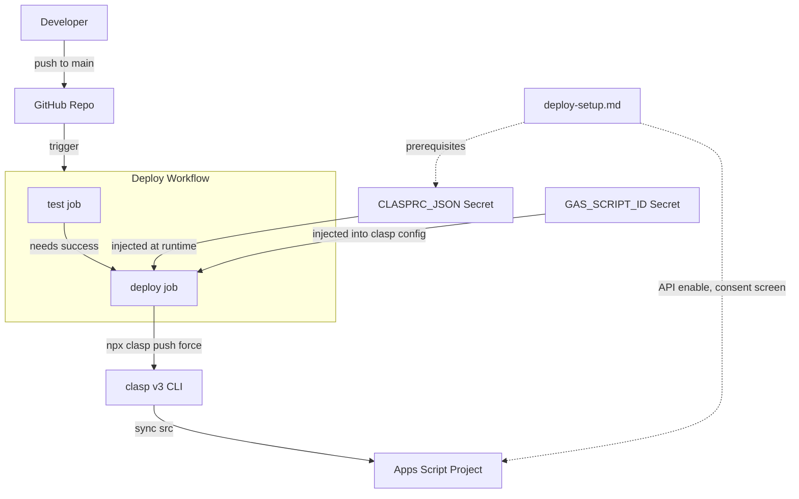
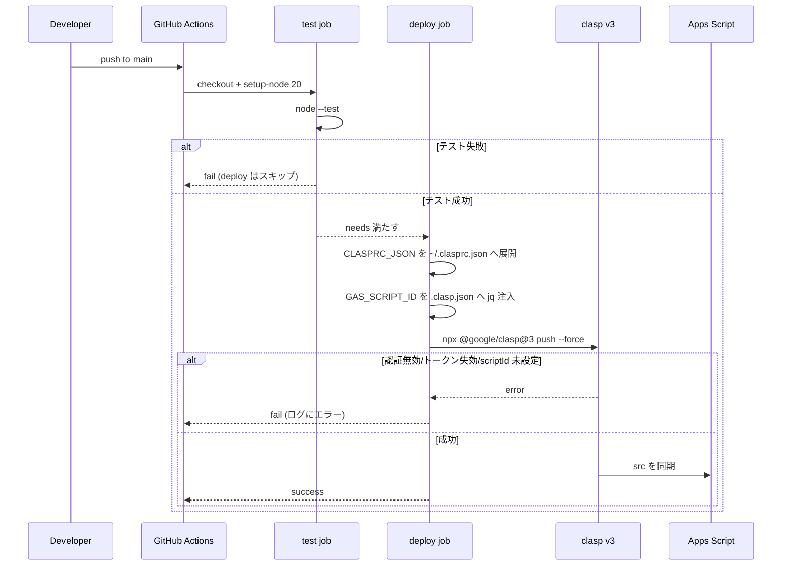

# Design Document

## Overview

**Purpose**: 本機能は、main ブランチへの push を契機に、テスト通過を条件として Google Apps Script (GAS) へソースを自動反映する CI/CD パイプラインを提供する。これにより、開発者の手動 `clasp push` を不要にし、GitHub 上のソースと GAS 上の実行コードの乖離を防ぐ。

**Users**: 本リポジトリのメンテナ（開発者・プロジェクト管理者）が、コードを main にマージするだけで GAS への反映を完了できるようになる。

**Impact**: 現状の「ローカルからの手動デプロイ」を「main への push を起点とした自動デプロイ」へ置き換える。アプリケーションコード（`src/` 配下のロジック）自体は変更しない。GitHub Actions ワークフローとセットアップドキュメントを新規追加する。

### Goals
- main への push でテスト → デプロイを自動実行する
- テスト失敗時は GAS に反映しない（デプロイゲート）
- 認証情報を Secrets で安全に管理し、リポジトリに永続化しない
- デプロイ成否を Actions UI / ログで確認可能にする
- 自動デプロイ成立に必要な CI 外前提（API 有効化・同意画面）と復旧手順をドキュメント化する

### Non-Goals
- versioned deploy（`clasp deploy` によるバージョン付きデプロイ、Web アプリ/API 実行版の公開）
- GCP サービスアカウント認証
- GitHub リポジトリ作成・リモート設定（ユーザー側で用意済み）
- PR プレビューデプロイ、staging/prod の複数環境分岐
- GAS の時間主導トリガー設定、`src/` 配下のアプリケーションロジック変更
- テストの追加・改変（既存テストスイートを利用するのみ）

## Boundary Commitments

### This Spec Owns
- GitHub Actions ワークフロー定義（`.github/workflows/deploy.yml`）：トリガー条件、テストジョブ、デプロイジョブ、Secret のファイル化、clasp 実行
- 自動デプロイのセットアップ・運用ドキュメント（`docs/deploy-setup.md`）
- 認証情報の受け渡し契約（Secret 名 `CLASPRC_JSON` とランナー上の `~/.clasprc.json` への展開規約）
- デプロイ先 scriptId の受け渡し契約（Secret 名 `GAS_SCRIPT_ID` とデプロイ時の `.clasp.json` への注入規約）

### Out of Boundary
- `src/` 配下の GAS ソース（`gmail-label-archiver` spec が所有）
- 既存テストコード（`test/` 配下）の内容
- `.clasp.json` の `rootDir` 等 scriptId 以外の設定（既存のものを利用するのみ）
- リポジトリにコミットされた `.clasp.json` の実 scriptId 管理（実 scriptId は Secret で管理し、コミット版は placeholder を維持。ランナー上での注入はデプロイ時の一時操作）
- GAS のトリガー設定・実行スケジュール
- versioned deploy・複数環境・サービスアカウント認証

### Allowed Dependencies
- 既存 `.clasp.json`（コミット版は placeholder `scriptId` + `rootDir: src`）— `rootDir` の入力として参照。scriptId はデプロイ時に Secret から注入
- 既存テストスイート（`node --test`、外部依存なし）— デプロイゲートとして実行
- 外部 CLI: `@google/clasp` v3 系（`npx` 経由、ランナー上でのみ使用）
- `jq`（GitHub ホスト ubuntu ランナーにプリインストール）— `.clasp.json` への scriptId 注入に使用
- GitHub Actions ランナー（`ubuntu-latest`）、`actions/checkout`、`actions/setup-node`（Node 20）
- GitHub Secrets（`CLASPRC_JSON`, `GAS_SCRIPT_ID`）

### Revalidation Triggers
- 認証方式の変更（clasp トークン → サービスアカウント等）
- Secret 名・形式の変更（`CLASPRC_JSON` / `GAS_SCRIPT_ID` の rename、clasp メジャーバージョン更新に伴う認証ファイル形式変更）
- デプロイ対象の変更（`.clasp.json` の `rootDir` 変更、`.claspignore` 追加）
- トリガーブランチ・トリガー条件の変更
- テストコマンド（`node --test`）の変更

## Architecture

### Existing Architecture Analysis
- 既存はローカル開発 + 手動 `clasp push` 運用。CI/CD は未整備。
- `.clasp.json`（`scriptId`, `rootDir: src`）は既にコミット済み。`src/` に GAS ソース、`test/` に `node:test` ベースのテストが分離配置されており、`.claspignore` なしでもテストは push 対象に含まれない。
- 外部依存（npm dependencies）が無いため、CI でのインストール手順は不要。
- 本機能はこの構成に対し、リポジトリ外形（`.github/`, `docs/`）への追加のみで成立し、既存ロジックには干渉しない。

### Architecture Pattern & Boundary Map



**Architecture Integration**:
- Selected pattern: GitHub Actions の 2 ジョブパイプライン（`test` ゲート → `deploy`）。`deploy.needs: test` により、テスト通過時のみデプロイが走る。
- Domain/feature boundaries: ワークフロー（CI ロジック）とドキュメント（運用手順）の 2 コンポーネントに分離。アプリケーションロジックとは完全に独立。
- Existing patterns preserved: `.clasp.json` の既存設定、`node --test` の既存テスト規約をそのまま利用。
- New components rationale: 自動化のためのワークフロー定義と、CI 外前提を補う運用ドキュメントが必須。
- Steering compliance: steering ドキュメントは未整備のため、プロジェクトの最小構成（依存なし・ファイル追加のみ）を踏襲。

### Technology Stack

| Layer | Choice / Version | Role in Feature | Notes |
|-------|------------------|-----------------|-------|
| Infrastructure / Runtime | GitHub Actions (`ubuntu-latest`) | パイプライン実行基盤 | push トリガー |
| Infrastructure / Runtime | `actions/setup-node` → Node 20 | clasp v3 とテスト実行のランタイム | clasp v3 は Node>=20 必須 |
| Deploy Tooling | `@google/clasp` v3 系（`npx @google/clasp@3`） | GAS へのソース同期（push） | メジャー固定。認証ファイル v3 形式 |
| Test | `node --test`（標準テストランナー） | デプロイゲート | 外部依存なし、インストール不要 |
| Deploy Tooling | `jq`（ランナープリインストール） | `.clasp.json` への scriptId 注入 | GitHub ホスト ubuntu に標準搭載 |
| Secrets | GitHub Secrets `CLASPRC_JSON` | clasp 認証情報の供給 | v3 `tokens` 形式 JSON |
| Secrets | GitHub Secrets `GAS_SCRIPT_ID` | デプロイ先 scriptId の供給 | コミット版 `.clasp.json` は placeholder |

## File Structure Plan

### Directory Structure
```
.github/
└── workflows/
    └── deploy.yml          # 新規: push(main)トリガーの test→deploy パイプライン
docs/
└── deploy-setup.md         # 新規: Secret登録/API有効化/同意画面/失効時復旧の手順
```

### Modified Files
- リポジトリの既存ファイル変更は行わない。`.clasp.json` のコミット版は placeholder `scriptId` のまま維持し、実 scriptId はデプロイ時にランナー上で一時注入する（リポジトリには永続化しない）。

> `deploy.yml` は単一の責務（CI/CD パイプライン定義）を持つ。`deploy-setup.md` は単一の責務（セットアップ・運用手順）を持つ。`src/` / `test/` は参照・利用のみで変更しない。`.clasp.json` はコミット版を placeholder に保ち、scriptId はランナー上で `jq` 注入するのみ。`.gitignore` の `.clasprc.json` 除外は維持される（認証情報は Secret 経由のみ）。

## System Flows



**Flow-level decisions**:
- トリガーは `on.push.branches: [main]` に限定。main 以外の push はワークフロー自体が起動しない（要件1.2）。
- ゲートは `deploy.needs: [test]` で実現。test 失敗時、deploy はスキップされワークフロー全体が失敗（要件2.3）。
- 認証展開は deploy ジョブ内で `CLASPRC_JSON` を環境変数経由でファイル化してから clasp を実行（要件4.3）。
- scriptId は deploy ジョブ内で `GAS_SCRIPT_ID` を `env:` 経由で受け取り、`jq` で `.clasp.json` の `scriptId` に注入してから clasp を実行（要件3.4, 4.6）。
- `concurrency` グループ（`deploy-gas`, `cancel-in-progress: false`）で deploy を直列化し、連続 push 時の反映順序の事故を防ぐ。

## Requirements Traceability

| Requirement | Summary | Components | Interfaces | Flows |
|-------------|---------|------------|------------|-------|
| 1.1 | main push で自動起動 | Deploy Workflow | `on.push.branches:[main]` | push→trigger |
| 1.2 | main 以外は非デプロイ | Deploy Workflow | branches フィルタ | trigger gating |
| 1.3 | 手動操作なしで一貫実行 | Deploy Workflow | jobs 連鎖 | 全フロー |
| 2.1 | デプロイ前にテスト実行 | Deploy Workflow (test job) | `node --test` step | test job |
| 2.2 | 成功時のみデプロイへ | Deploy Workflow | `needs: test` | gate |
| 2.3 | 失敗時はデプロイせず失敗終了 | Deploy Workflow | job fail → skip deploy | gate(失敗分岐) |
| 3.1 | src を GAS へ反映 | Deploy Workflow (deploy job) | `clasp push` step | deploy job |
| 3.2 | 非対話デプロイ | Deploy Workflow | `push --force` | deploy job |
| 3.3 | versioned deploy しない | Deploy Workflow | push のみ（deploy 不使用） | deploy job |
| 3.4 | Secret の scriptId を注入しデプロイ先決定 | Deploy Workflow | `jq` で `.clasp.json` 注入 | deploy job |
| 4.1 | 認証を Secrets から取得 | Deploy Workflow | `secrets.CLASPRC_JSON` | deploy job |
| 4.2 | 認証をリポジトリに永続化しない | Deploy Workflow / .gitignore | Secret 経由のみ | deploy job |
| 4.3 | Secret を展開後に clasp 実行 | Deploy Workflow | env→`~/.clasprc.json` step | deploy job |
| 4.4 | 認証不在/無効で失敗終了 | Deploy Workflow | clasp 非0終了 | deploy(失敗分岐) |
| 4.5 | scriptId を Secrets 管理しコミットしない | Deploy Workflow | `secrets.GAS_SCRIPT_ID`, placeholder 維持 | deploy job |
| 4.6 | scriptId を注入後に clasp 実行 | Deploy Workflow | env→`jq`→`.clasp.json` step | deploy job |
| 5.1 | 各ステップ成否をログ化 | Deploy Workflow | Actions step ログ | 全フロー |
| 5.2 | 成功時 success 終了 | Deploy Workflow | job 成功 | deploy(成功分岐) |
| 5.3 | 失敗時 failure 終了 | Deploy Workflow | job 失敗 | deploy(失敗分岐) |
| 5.4 | トークン失効時に失敗+ログ記録 | Deploy Workflow | clasp エラー出力 | deploy(失敗分岐) |
| 6.1 | 認証情報と scriptId の Secret 登録手順 | Setup Documentation | `deploy-setup.md` | — |
| 6.2 | Apps Script API 有効化を明記 | Setup Documentation | `deploy-setup.md` | — |
| 6.3 | 同意画面公開の注意 | Setup Documentation | `deploy-setup.md` | — |
| 6.4 | 失効時の復旧手順 | Setup Documentation | `deploy-setup.md` | — |

## Components and Interfaces

| Component | Domain/Layer | Intent | Req Coverage | Key Dependencies (P0/P1) | Contracts |
|-----------|--------------|--------|--------------|--------------------------|-----------|
| Deploy Workflow | CI/CD Infra | push→test→deploy の自動化 | 1.x, 2.x, 3.x, 4.x, 5.x | GitHub Actions (P0), clasp v3 (P0), CLASPRC_JSON (P0), GAS_SCRIPT_ID (P0), jq (P1), .clasp.json (P1) | Batch |
| Setup Documentation | Docs/Ops | 前提作業と復旧手順の提供 | 6.x | clasp/GAS 前提知識 (P1) | — |

### CI/CD Infra

#### Deploy Workflow

| Field | Detail |
|-------|--------|
| Intent | main への push を起点に、テスト通過を条件として GAS へソースを同期する GitHub Actions ワークフロー |
| Requirements | 1.1, 1.2, 1.3, 2.1, 2.2, 2.3, 3.1, 3.2, 3.3, 3.4, 4.1, 4.2, 4.3, 4.4, 4.5, 4.6, 5.1, 5.2, 5.3, 5.4 |

**Responsibilities & Constraints**
- トリガーを `push` かつ `branches: [main]` に限定する
- `concurrency` グループで deploy を直列化し、同時 push 時の `clasp push` 並走を防ぐ
- `test` ジョブで既存テストスイートを実行し、`deploy` ジョブを `needs: test` でゲートする
- `deploy` ジョブで Secret `CLASPRC_JSON` を `~/.clasprc.json` に展開し、Secret `GAS_SCRIPT_ID` を `.clasp.json` の `scriptId` へ `jq` で注入したうえで、`npx @google/clasp@3 push --force` を実行する
- 認証情報および実 scriptId をワークフローファイルやリポジトリに永続化しない（Secret 経由のみ、ジョブ終了で揮発。コミット版 `.clasp.json` は placeholder を維持）
- `clasp push` のみを行い、`clasp deploy`（versioned deploy）は実行しない
- いずれかのステップ失敗時はジョブを非0終了させ、ワークフローを failure とする

**Dependencies**
- External: GitHub Actions ランタイム（`ubuntu-latest`, `actions/checkout`, `actions/setup-node`）— 実行基盤 (P0)
- External: `@google/clasp` v3（`npx` 取得）— GAS への push (P0)
- Inbound: GitHub Secrets `CLASPRC_JSON` — 認証情報供給 (P0)
- Inbound: GitHub Secrets `GAS_SCRIPT_ID` — デプロイ先 scriptId 供給 (P0)
- External: `jq`（ランナープリインストール）— `.clasp.json` への scriptId 注入 (P1)
- Outbound: `.clasp.json`（`rootDir`、注入後の `scriptId`）— デプロイ先決定 (P1)

**Contracts**: Service [ ] / API [ ] / Event [ ] / Batch [x] / State [ ]

##### Batch / Job Contract
- **Trigger**: `on.push.branches: [main]`。main 以外の push、PR、手動以外では起動しない。
- **Concurrency**: ワークフローに `concurrency: { group: deploy-gas, cancel-in-progress: false }` を設定し、deploy を直列化する。短時間に複数 push があっても `clasp push` が並走せず、後勝ちによる反映順序の事故を防ぐ。`cancel-in-progress: false` により実行中のデプロイは中断せず順番に処理する。
- **Input / validation**:
  - リポジトリのチェックアウト内容（`src/`, placeholder の `.clasp.json`）
  - Secret `CLASPRC_JSON`（clasp v3 `tokens` 形式 JSON）。不在/無効の場合は clasp 実行が失敗する。
  - Secret `GAS_SCRIPT_ID`（デプロイ先 GAS スクリプト ID）。不在/空の場合は scriptId が placeholder のままとなり clasp 実行が失敗する。
- **Jobs**:
  - `test`: `actions/checkout` → `actions/setup-node`(Node 20) → `node --test`。外部依存インストール不要。
  - `deploy`（`needs: [test]`）: `actions/checkout` → `actions/setup-node`(Node 20) → 認証情報を `printf '%s' "$CLASPRC_JSON" > "$HOME/.clasprc.json"` で展開 → `jq` で `GAS_SCRIPT_ID` を `.clasp.json` の `scriptId` へ注入 → `npx @google/clasp@3 push --force`。Secret はいずれも `env:` 経由で渡し、コマンド行やログに露出させない。
- **Output / destination**: 注入後の `.clasp.json` の `scriptId` が指す Apps Script プロジェクトへ `src/` を同期。
- **Idempotency & recovery**: `clasp push --force` は冪等（同一ソースの再 push は安全）。失敗時は再実行で回復。リフレッシュトークン失効時は Secret 更新後に再実行（手順は Setup Documentation）。

**Implementation Notes**
- Integration: コミット版 `.clasp.json`（placeholder `scriptId` + `rootDir: src`）を利用し、デプロイ時に scriptId のみ `jq` で上書き。`.claspignore` は不要（`test/` は `rootDir: src` 外）。
- Validation: `node --test` 失敗時に deploy がスキップされること、`CLASPRC_JSON`/`GAS_SCRIPT_ID` 未設定時に deploy が失敗することを確認（Testing Strategy 参照）。
- Risks: 認証情報の env→file 展開時のクォート事故 → `printf '%s'` + 環境変数経由で回避。scriptId 注入時の Secret 露出 → `env:` 経由 + `jq --arg` で回避。clasp メジャー更新による形式変更 → `@3` 固定。

### Docs/Ops

#### Setup Documentation

| Field | Detail |
|-------|--------|
| Intent | 自動デプロイの初期構築と継続運用に必要な、CI 外の前提作業と復旧手順を提供する |
| Requirements | 6.1, 6.2, 6.3, 6.4 |

**Responsibilities & Constraints**
- ローカルで `clasp login` 済みの `~/.clasprc.json`（v3 `tokens` 形式）を Secret `CLASPRC_JSON` として登録する手順を記載する
- デプロイ先の scriptId を Secret `GAS_SCRIPT_ID` として登録する手順を記載する（`.clasp.json` の `scriptId` 値から取得）
- Apps Script API を `script.google.com/home/usersettings` で有効化する必要があることを明記する
- OAuth 同意画面を「テスト中」のままにするとリフレッシュトークンが約7日で失効するため、公開設定が推奨である旨を注意点として記載する
- トークン失効時に `clasp login` し直して Secret を更新する復旧手順を記載する

**Dependencies**
- External: clasp/GAS の前提知識（API 有効化・OAuth 設定）(P1)

**Contracts**: 該当なし（ドキュメント成果物）

**Implementation Notes**
- Integration: ワークフローが要求する Secret 名（`CLASPRC_JSON`, `GAS_SCRIPT_ID`）と形式（v3 `tokens` / scriptId 文字列）を Deploy Workflow と一致させる。
- Validation: 記載手順どおりに設定すると CI のデプロイが成功することを、初回セットアップで実機確認する（Manual verification）。
- Risks: v2 フラット形式の貼り付けミス → v3 `tokens` 形式の例を明示して回避。

## Error Handling

### Error Strategy
本機能のエラーは「ジョブの非0終了 + Actions ログ」で一貫して表面化させる。独自のリトライ/サーキットブレーカは導入しない（再実行は Actions の手動 re-run で対応）。

### Error Categories and Responses
- **テスト失敗（ゲート）**: `test` ジョブが失敗 → `deploy` はスキップ → ワークフロー failure（要件2.3）。
- **認証エラー（Secret 不在/無効/トークン失効）**: `clasp push` が非0終了 → `deploy` ジョブ failure、原因が clasp の標準エラーとしてログに残る（要件4.4, 5.4）。復旧は Setup Documentation の Secret 更新手順。
- **API 未有効化**: `clasp push` がエラー終了 → failure。恒久対処は API 有効化（要件6.2、CI では自動化不可）。
- **デプロイ成功**: `deploy` ジョブ success → ワークフロー success（要件5.2）。

### Monitoring
- GitHub Actions の実行ログとジョブステータスを唯一の監視面とする（要件5.1）。各ステップ（checkout / setup-node / test / 認証展開 / clasp push）の成否がステップ単位で可視化される。

## Testing Strategy

> 本機能の成果物はワークフロー定義とドキュメントであり、検証は主に「ワークフローの実挙動確認（手動/実 push）」と「既存テストがゲートとして機能すること」で行う。

### Integration Tests（ワークフロー挙動）
1. main への push で `test` → `deploy` が起動し、success で終了すること（1.1, 1.3, 2.2, 3.1, 5.2）。
2. テストをわざと失敗させた場合に `deploy` がスキップされ、ワークフローが failure になること（2.1, 2.3）。
3. Secret `CLASPRC_JSON` 未設定/無効の場合に `deploy` が failure になり、ログに認証エラーが残ること（4.1, 4.4, 5.4）。
4. main 以外のブランチへの push でワークフローが起動しないこと（1.2）。

### Unit/Static Checks
1. ワークフロー YAML が有効で、`on.push.branches` が `[main]` に限定されていること（1.1, 1.2）。
2. `deploy` ジョブに `needs: test` が設定されていること（2.2）。
3. clasp 実行が `push --force` であり `deploy`（versioned）を含まないこと（3.2, 3.3）。
4. 認証展開が Secret 経由のみで、平文認証情報がリポジトリ/ワークフローに含まれないこと（4.2）。

### Manual Verification
1. Setup Documentation の手順どおりに Secret 登録・API 有効化を行い、実 push で GAS にソースが反映されることを確認（3.1, 3.4, 6.1, 6.2）。
2. ドキュメントに同意画面公開の注意と失効時復旧手順が記載されていることを確認（6.3, 6.4）。

## Security Considerations
- 認証情報（clasp v3 トークン）は GitHub Secrets のみで管理し、リポジトリ・ワークフローファイルに平文で含めない。ランナー上の `~/.clasprc.json` はジョブ終了で破棄される。
- `.gitignore` の `.clasprc.json` 除外を維持し、ローカル認証情報の誤コミットを防ぐ。
- デプロイ先 `scriptId` は GitHub Secrets（`GAS_SCRIPT_ID`）で管理し、リポジトリには placeholder のみをコミットする。プロジェクト方針として scriptId をリポジトリに露出させない（実 scriptId はデプロイ時にランナー上で `.clasp.json` に一時注入し、ジョブ終了で破棄）。Secret は `env:` 経由 + `jq --arg` で渡し、コマンド行・ログに露出させない。
- OAuth 同意画面を公開設定にしてリフレッシュトークンの短期失効を避けることを推奨（運用上の可用性とセキュリティのバランス）。
