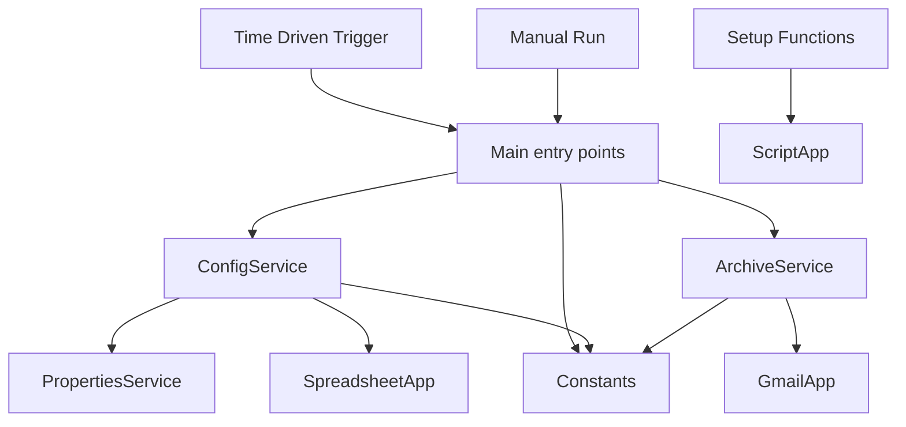
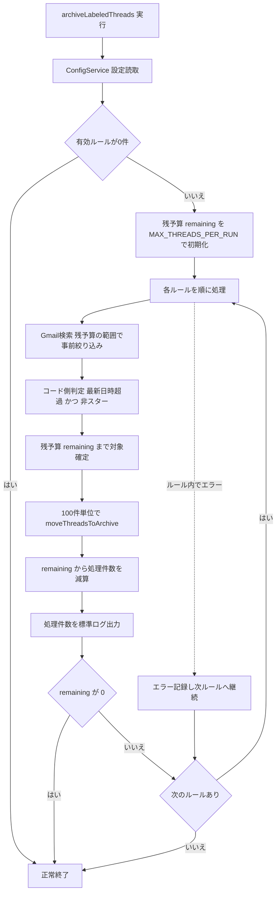

# Design Document

## Overview

**Purpose**: 個人の Gmail ユーザーが、ラベルごとに設定した「受信トレイ保持日数」を超えたスレッドを自動的に受信トレイから外す（標準アーカイブする）仕組みを提供する。設定は Google スプレッドシートで管理し、コード変更なしに対象ラベルと保持日数を調整できる。

**Users**: 自分の Gmail を整理したい個人ユーザー。Apps Script に Gmail / Spreadsheet 権限を付与し、設定シートと日次トリガーを用意して利用する。

**Impact**: 現状の手動アーカイブ／Gmail フィルタによる即時アーカイブに対し、「受信（最新メッセージ日時）から N 日後」という時間ベースかつラベル別の自動アーカイブを新たに実現する。本機能は Google Apps Script のスタンドアロンプロジェクトとして clasp で管理される。

### Goals
- スプレッドシートの `ラベル名 | 保持日数` 表に基づき、対象スレッドを受信トレイから自動アーカイブする。
- 1 日 1 回の時間トリガーで無人運用できる。
- 一部の不正設定行・ラベル不在・大量メールがあっても、安全に他の処理を継続する。

### Non-Goals
- 通知機能やリッチな実行ログ基盤（標準実行ログへの最小限出力のみ）。
- アーカイブ以外のメール操作（削除・転送・既読変更・ラベル付け替え）。
- 複数アカウント対応、Web UI / ダッシュボード。
- 設定スプレッドシート自体やラベルの作成（利用者が事前に用意する）。

## Boundary Commitments

### This Spec Owns
- 設定シート（`ラベル名 | 保持日数`）の読み取りとバリデーション。
- ラベル＋経過日数（最新メッセージ日時基準）＋スター除外による対象スレッド抽出。
- 受信トレイから外す標準アーカイブ実行（件数上限・バッチ分割を含む）。
- 1 日 1 回の時間トリガーの冪等なセットアップ／削除。
- Apps Script マニフェスト（`appsscript.json`）と clasp プロジェクト構成。
- 参照する設定スプレッドシートを指す Script Properties（`CONFIG_SPREADSHEET_ID`, `CONFIG_SHEET_NAME`）の読み取り。

### Out of Boundary
- 通知・実行ログの永続化（Apps Script 標準実行ログ以外）。
- 設定スプレッドシートおよび Gmail ラベルの作成・管理。
- アーカイブ以外の Gmail 操作。
- Script Properties への ID 値の投入手順自体（利用者がセットアップ時に手動設定。値の読み取りのみ本スペックが担う）。

### Allowed Dependencies
- Google Apps Script ランタイム（V8）と組み込みサービス: `GmailApp`, `SpreadsheetApp`, `ScriptApp`, `PropertiesService`。
- clasp（ローカル開発・デプロイツール）。
- 外部ライブラリ・課金サービスへの依存は禁止（要件 5.3）。

### Revalidation Triggers
- 設定シートのスキーマ変更（列の追加・順序変更・ヘッダ名変更）。
- Script Property キー名（`CONFIG_SPREADSHEET_ID` / `CONFIG_SHEET_NAME`）の変更。
- アーカイブ対象判定ロジック（経過日数基準・スター除外）の意味変更。
- 必要 OAuth スコープの変更。

## Architecture

### Architecture Pattern & Boundary Map

採用パターン: **関数モジュール分割**。Google Apps Script はファイル間に import の概念がなく全 `.gs` がグローバルスコープを共有するため、ファイルを論理モジュールとして責務分離し、依存方向を規約で担保する。



**Architecture Integration**:
- Selected pattern: 関数モジュール分割（責務ごとにファイル分離、グローバル関数として公開）。
- Domain/feature boundaries: 設定読取（ConfigService）／アーカイブ実行（ArchiveService）／エントリ・トリガー（Main）を分離。
- New components rationale: 設定とアーカイブを分離することで、抽出条件やシート形式の変更が互いに波及しない。
- Steering compliance: steering 未整備のため、本設計の依存方向規約を基準とする。

**依存方向（左が下位、上位は下位のみ参照）**:
`Constants → ConfigService → ArchiveService → Main`
- `Main` は `ConfigService` と `ArchiveService` を呼び出す（オーケストレーション）。
- `ConfigService` / `ArchiveService` は `Constants` のみを参照し、互いに参照しない。
- 上位を参照する依存（例: ConfigService が Main を呼ぶ）は禁止。

### Technology Stack

| Layer | Choice / Version | Role in Feature | Notes |
|-------|------------------|-----------------|-------|
| Runtime | Google Apps Script (V8 runtime) | スクリプト実行環境 | `appsscript.json` で `runtimeVersion: V8` |
| Mail | `GmailApp`（組み込み） | スレッド検索・アーカイブ・スター/日時判定 | `search` 最大500件/回、`moveThreadsToArchive` 最大100件/回 |
| Config Store | `SpreadsheetApp` + `PropertiesService`（組み込み） | 設定シート読取、対象シートID保持 | Script Properties に Spreadsheet ID |
| Scheduler | `ScriptApp`（組み込み） | 日次時間トリガーの作成・削除 | `timeBased().everyDays(1)` |
| Tooling | clasp（最新安定版） | ローカル開発・push/pull・Git 管理 | `.clasp.json` の `rootDir: "src"` |

## File Structure Plan

### Directory Structure
```
.clasp.json                 # clasp設定（scriptId, rootDir: "src"）。scriptId は各自で設定
src/
├── appsscript.json         # マニフェスト（timeZone, V8, OAuthスコープ）
├── Constants.js            # 定数: Script Propertyキー, 既定シート名, 件数上限, バッチサイズ, ヘッダ列名
├── Config.js               # ConfigService: 設定シート読取 → ArchiveRule[] + バリデーション
├── Archiver.js             # ArchiveService: ルール単位の対象抽出・権威的判定・バッチアーカイブ
└── Main.js                 # エントリ: archiveLabeledThreads(), setupDailyTrigger(), removeAllTriggers()
```

> clasp は `src/*.js` を `.gs` として push する。ファイル間に import はなく、各ファイルのトップレベル関数がグローバルに公開される。論理的な依存方向は上記アーキテクチャの規約に従う。

### Modified Files
- なし（greenfield。全ファイル新規作成）。

## System Flows

### 日次アーカイブ処理フロー



ルール単位で try/catch し、1 ルールの失敗が全体を止めない（要件 5.2）。残予算 `remaining` を全ルールで共有することで、実行全体の合計処理件数を `MAX_THREADS_PER_RUN` に束ね、Apps Script の実行時間上限超過を防ぐ（要件 5.1）。アーカイブ済みスレッドは次回実行時 `in:inbox` に該当しないため、上限超過分は自然に次回へ持ち越される（要件 5.1）。

## Requirements Traceability

| Requirement | Summary | Components | Interfaces | Flows |
|-------------|---------|------------|------------|-------|
| 1.1 | 設定シートから各行を読取 | ConfigService | `readArchiveRules()` | アーカイブ処理フロー（ReadCfg） |
| 1.2 | 保持日数を日単位しきい値として解釈 | ConfigService | `readArchiveRules()` | — |
| 1.3 | データ行0件なら何もせず正常終了 | ConfigService, Main | `readArchiveRules()` | Empty 分岐 |
| 1.4 | 不正な保持日数行をスキップし継続 | ConfigService | `readArchiveRules()`（バリデーション） | — |
| 1.5 | 空ラベル名行をスキップし継続 | ConfigService | `readArchiveRules()`（バリデーション） | — |
| 2.1 | ラベル＋受信トレイ＋経過日数で抽出 | ArchiveService | `archiveRule()` / `buildQuery()` | Search, Filter |
| 2.2 | 経過日数は最新メッセージ日時基準 | ArchiveService | `isOlderThan()`（`getLastMessageDate`） | Filter |
| 2.3 | 受信トレイ外スレッドを除外 | ArchiveService | `buildQuery()`（`in:inbox`） | Search |
| 2.4 | ラベル不在行をスキップし継続 | ArchiveService | `archiveRule()`（検索0件/例外処理） | ErrLog |
| 2.5 | 経過日数が保持日数以下なら除外 | ArchiveService | `isOlderThan()` | Filter |
| 2.6 | スター付きスレッドを除外 | ArchiveService | `hasStar()`（`hasStarredMessages`）+ `-is:starred` | Filter |
| 3.1 | 対象を受信トレイから外す | ArchiveService | `archiveThreads()`（`moveThreadsToArchive`） | Batch |
| 3.2 | INBOX以外の既存ラベルを変更しない | ArchiveService | `archiveThreads()` | Batch |
| 3.3 | 削除・転送・既読変更を行わない | ArchiveService | （アーカイブAPIのみ使用） | Batch |
| 3.4 | 対象0件なら何もせず正常終了 | ArchiveService | `archiveRule()` | Filter→Cap |
| 4.1 | 日次トリガーのセットアップ手段提供 | Main | `setupDailyTrigger()` | — |
| 4.2 | 重複作成せず1件登録 | Main | `setupDailyTrigger()`（既存削除→作成） | — |
| 4.3 | 手動実行も同一処理 | Main | `archiveLabeledThreads()` | アーカイブ処理フロー全体 |
| 5.1 | 件数上限（実行全体）＋次回持ち越し | Main, ArchiveService, Constants | `archiveLabeledThreads()`（残予算管理）／`archiveRule(rule, now, remaining)`（`MAX_THREADS_PER_RUN`） | Init, Cap, Batch, Budget |
| 5.2 | 行エラー記録し継続 | Main, ArchiveService | ルール単位 try/catch | ErrLog |
| 5.3 | 外部依存なし | （全体） | 組み込みサービスのみ | — |
| 5.4 | 処理結果を標準ログ出力 | ArchiveService, Main | `Logger.log` / `console.log` | Log |

## Components and Interfaces

| Component | Domain/Layer | Intent | Req Coverage | Key Dependencies (P0/P1) | Contracts |
|-----------|--------------|--------|--------------|--------------------------|-----------|
| ConfigService | Config | 設定シートを読み取り検証済みルール配列に変換 | 1.1–1.5 | PropertiesService (P0), SpreadsheetApp (P0) | Service |
| ArchiveService | Domain | ルール単位で対象抽出・判定・アーカイブ | 2.1–2.6, 3.1–3.4, 5.1, 5.4 | GmailApp (P0) | Service, Batch |
| Main | Entry/Runtime | エントリ関数とトリガー管理のオーケストレーション | 1.3, 4.1–4.3, 5.1, 5.2, 5.4 | ConfigService (P0), ArchiveService (P0), ScriptApp (P0) | Service, Batch |
| Constants | Shared | 定数の単一定義 | 5.1 | なし | State |

> 型はランタイム上 JavaScript（GAS V8）で表現される。以下のインターフェースは JSDoc 型注釈で実装時に明示する契約を示す。Apps Script では引数・戻り値に JSDoc 型ヒントを付与し、境界で入力検証する（型安全方針）。

### Config

#### ConfigService

| Field | Detail |
|-------|--------|
| Intent | Script Property が指す設定シートを読み、検証済みの `ArchiveRule[]` を返す |
| Requirements | 1.1, 1.2, 1.3, 1.4, 1.5 |

**Responsibilities & Constraints**
- Script Properties から `CONFIG_SPREADSHEET_ID`（必須）と `CONFIG_SHEET_NAME`（任意、既定 `settings`）を取得。
- 対象シートをヘッダ行＋データ行として読み、各データ行を `ArchiveRule` に変換。
- バリデーション: ラベル名が空（1.5）／保持日数が非数値・負・空（1.4）の行は除外。
- データ行が 0 件、または全行が無効な場合は空配列を返す（後段で何もせず正常終了、1.3）。

**Dependencies**
- External: `PropertiesService` — 設定シートID/シート名の取得 (P0)
- External: `SpreadsheetApp` — シートデータ読取 (P0)
- Outbound: `Constants` — Property キー名・既定シート名・ヘッダ列定義 (P1)

**Contracts**: Service [x] / API [ ] / Event [ ] / Batch [ ] / State [ ]

##### Service Interface
```javascript
/**
 * @typedef {Object} ArchiveRule
 * @property {string} labelName    対象ラベル名（非空）
 * @property {number} retentionDays 受信トレイ保持日数（正の整数）
 */

/**
 * 設定シートを読み、検証済みルール配列を返す。
 * @returns {ArchiveRule[]} 有効な行のみ。0件なら空配列。
 * @throws {Error} CONFIG_SPREADSHEET_ID 未設定、またはシート/スプレッドシートが開けない場合
 */
function readArchiveRules() {}

/**
 * 1 行分のラベル名・保持日数を検証し、有効なら ArchiveRule に変換する純粋関数。
 * 副作用なし（テスト容易）。`readArchiveRules` が行ごとに呼ぶ。
 * @param {string} label 生のラベル名セル値
 * @param {string|number} days 生の保持日数セル値
 * @returns {ArchiveRule|null} 有効なら ArchiveRule、無効（空ラベル/非数値/負/空日数）なら null
 */
function validateRow(label, days) {}
```
- Preconditions: Script Property `CONFIG_SPREADSHEET_ID` が設定済みで、当該スプレッドシートにアクセス権がある。
- Postconditions: 返却配列の各要素は `labelName` 非空かつ `retentionDays` が正の整数。
- Invariants: 無効行は黙ってスキップし、有効行の読取を妨げない（フェイルファストは「ID 未設定／シート不在」など構成不備に限定）。

**Implementation Notes**
- Integration: 設定シートは1行目をヘッダとみなし、2行目以降をデータとして処理する。列の対応はヘッダ名（既定 `ラベル名`, `保持日数`）で解決し、`Constants` に定義。
- Validation: `retentionDays` は `Number()` 変換後に `Number.isInteger` かつ `> 0` を満たすこと。空白セル・前後空白を trim。
- Risks: ヘッダ名の表記揺れ → `Constants` で定義した期待ヘッダに依存することを明記（Revalidation Trigger）。

### Domain

#### ArchiveService

| Field | Detail |
|-------|--------|
| Intent | 1 ルール分の対象スレッドを抽出・権威判定し、件数上限内でバッチアーカイブする |
| Requirements | 2.1, 2.2, 2.3, 2.4, 2.5, 2.6, 3.1, 3.2, 3.3, 3.4, 5.1, 5.4 |

**Responsibilities & Constraints**
- 検索クエリ生成（事前絞り込み）: `label:"<labelName>" in:inbox -is:starred older_than:<retentionDays>d`。
- 候補スレッドに対しコード側で権威的判定: 最新メッセージ日時がしきい値より古い（2.2/2.5）かつスター無し（2.6）。
- 確定対象を呼び出し側から渡された**残予算 `remaining`**（実行全体の残処理可能件数）まで採用し、`ARCHIVE_BATCH_SIZE`（最大100）単位で `moveThreadsToArchive` を呼ぶ（5.1/3.1）。1 ルール単独の上限ではなく、全ルール合算で `MAX_THREADS_PER_RUN` を超えないようにする。
- アーカイブ以外の操作（削除・転送・既読変更・ラベル変更）を行わない（3.2/3.3）。
- 各ルールの処理件数を標準ログへ出力（5.4）。

**Dependencies**
- External: `GmailApp` — 検索・スレッド属性取得・アーカイブ (P0)
- Outbound: `Constants` — 件数上限・バッチサイズ (P1)

**Contracts**: Service [x] / API [ ] / Event [ ] / Batch [x] / State [ ]

##### Service Interface
```javascript
/**
 * @typedef {Object} ArchiveResult
 * @property {string} labelName
 * @property {number} archivedCount  実際に受信トレイから外した件数
 * @property {number} candidateCount 検索でヒットした候補件数
 */

/**
 * 1ルール分の対象を抽出し、残予算の範囲内でアーカイブする。
 * @param {ArchiveRule} rule
 * @param {Date} now 経過日数判定の基準時刻（テスト容易性のため注入）
 * @param {number} remaining この呼び出しで処理してよい残件数（実行全体の残予算）
 * @returns {ArchiveResult}
 * @throws {Error} 検索・アーカイブ API が回復不能な失敗をした場合（呼び出し側でルール単位に捕捉）
 */
function archiveRule(rule, now, remaining) {}

/**
 * ルールから Gmail 検索クエリ文字列を生成する純粋関数（副作用なし）。
 * ラベル名は二重引用符で囲む。
 * @param {ArchiveRule} rule
 * @returns {string} `label:"<labelName>" in:inbox -is:starred older_than:<retentionDays>d`
 */
function buildQuery(rule) {}

/**
 * 最新メッセージ日時が保持日数のしきい値より古いかを判定する純粋関数（副作用なし）。
 * 経過日数がちょうど保持日数以下なら false（除外、2.5）。
 * @param {Date} lastMessageDate スレッド内最新メッセージの日時（2.2）
 * @param {number} retentionDays
 * @param {Date} now 基準時刻
 * @returns {boolean} アーカイブ対象なら true
 */
function isOlderThan(lastMessageDate, retentionDays, now) {}

/**
 * スレッドにスター付きメッセージが存在するかを判定する（`hasStarredMessages` ラッパ）。
 * @param {GmailThread} thread
 * @returns {boolean} スター付きが1件でもあれば true（対象から除外、2.6）
 */
function hasStar(thread) {}
```
- Preconditions: `rule` は検証済み（`labelName` 非空、`retentionDays > 0`）。`remaining ≥ 0`。
- Postconditions: 受信トレイから外したスレッド数 = `archivedCount ≤ remaining`。スター付き・しきい値以下のスレッドは含まれない。
- Invariants: アーカイブ以外の Gmail 状態を変更しない。実行全体での合計アーカイブ件数は `MAX_THREADS_PER_RUN` を超えない（残予算は `Main` が管理）。

##### Batch / Job Contract
- Trigger: `Main.archiveLabeledThreads()` からルールごとに呼び出し。
- Input / validation: 検証済み `ArchiveRule`。検索0件・対象0件は正常（3.4）。
- Output / destination: 対象スレッドの INBOX ラベル除去（標準アーカイブ）。
- Idempotency & recovery: アーカイブ済みは次回 `in:inbox` に該当せず再対象化されないため冪等。件数上限超過分は次回実行で処理（5.1）。

**Implementation Notes**
- Integration: ラベル名は常に二重引用符で囲みクエリ化（空白・階層ラベル対応）。検索は `GmailApp.search(query, 0, Math.min(remaining, ARCHIVE_SEARCH_LIMIT))` で残予算の範囲に絞って取得（`ARCHIVE_SEARCH_LIMIT ≤ 500`、GmailApp.search 上限）。
- Validation: 候補各スレッドを `getLastMessageDate()` と `hasStarredMessages()` で再判定し、`older_than`/`-is:starred` の近似を補正。
- Risks: ラベル不在時は検索結果0件として安全に空動作（2.4）。`moveThreadsToArchive` の100件制限を超える呼び出しを避けるため必ず分割。

### Entry / Runtime

#### Main

| Field | Detail |
|-------|--------|
| Intent | トリガー/手動の共通エントリと、日次トリガーの冪等な設定・削除 |
| Requirements | 1.3, 4.1, 4.2, 4.3, 5.1, 5.2, 5.4 |

**Responsibilities & Constraints**
- `archiveLabeledThreads()`: `readArchiveRules()` → 残予算 `remaining` を `MAX_THREADS_PER_RUN` で初期化し、各ルールを `archiveRule(rule, now, remaining)` で処理して `remaining -= archivedCount` を更新。`remaining` が 0 になったら以降のルールを処理せず終了（未処理分は次回実行へ持ち越し、5.1）。ルール単位 try/catch でエラーを記録し継続（5.2）。トリガーからも手動からも同一（4.3）。有効ルール0件なら何もせず正常終了（1.3）。
- `setupDailyTrigger()`: 既存の同一ハンドラ（`archiveLabeledThreads`）トリガーを全削除してから日次トリガーを1件作成（4.1/4.2）。
- `removeAllTriggers()`: 同一ハンドラのトリガーを全削除（運用補助）。
- 実行サマリ（ルール別件数・エラー）を標準ログに出力（5.4）。

**Dependencies**
- Outbound: `ConfigService.readArchiveRules` (P0)
- Outbound: `ArchiveService.archiveRule` (P0)
- External: `ScriptApp` — トリガー作成・列挙・削除 (P0)

**Contracts**: Service [x] / API [ ] / Event [ ] / Batch [x] / State [ ]

##### Service Interface
```javascript
/** トリガー/手動共通のエントリ。全ルールを処理する。 */
function archiveLabeledThreads() {}

/** 日次トリガーを冪等に登録（既存同一ハンドラを削除→1件作成）。 */
function setupDailyTrigger() {}

/** 同一ハンドラの全トリガーを削除。 */
function removeAllTriggers() {}
```
- Preconditions: `setupDailyTrigger` 実行時、スクリプトにトリガー管理権限がある。
- Postconditions: `setupDailyTrigger` 後、`archiveLabeledThreads` を指す日次トリガーがちょうど1件存在。
- Invariants: 1 ルールの失敗は他ルールの処理を止めない。

**Implementation Notes**
- Integration: トリガー実行時刻は実装定数（例 `TRIGGER_HOUR`）で指定。`everyDays(1).atHour(TRIGGER_HOUR)`。
- Validation: `setupDailyTrigger` は `getProjectTriggers()` を走査し `getHandlerFunction() === 'archiveLabeledThreads'` のものを削除してから作成。
- Risks: 構成不備（ID未設定）は `readArchiveRules` の例外として早期に表面化し、ログに残す。

### Shared

#### Constants
- `PROP_SPREADSHEET_ID = 'CONFIG_SPREADSHEET_ID'`, `PROP_SHEET_NAME = 'CONFIG_SHEET_NAME'`
- `DEFAULT_SHEET_NAME = 'settings'`
- `HEADER_LABEL = 'ラベル名'`, `HEADER_DAYS = '保持日数'`
- `MAX_THREADS_PER_RUN`（既定 300, **実行全体＝全ルール合算の上限**）, `ARCHIVE_BATCH_SIZE`（100, GmailApp `moveThreadsToArchive` 上限）, `ARCHIVE_SEARCH_LIMIT`（500, GmailApp `search` 上限）
- `TRIGGER_HANDLER = 'archiveLabeledThreads'`, `TRIGGER_HOUR`（既定 3）

## Error Handling

### Error Strategy
- **構成不備（フェイルファスト）**: `CONFIG_SPREADSHEET_ID` 未設定・スプレッドシート/シートが開けない場合は `readArchiveRules` が例外を投げ、`archiveLabeledThreads` がログに記録して終了。誤動作より明確な失敗を優先。
- **データ不備（スキップ継続）**: 空ラベル・不正な保持日数の行は除外して有効行を処理（1.4/1.5）。
- **ルール実行エラー（部分継続）**: あるルールの検索・アーカイブで例外が出ても捕捉・記録し、次ルールを処理（5.2）。

### Error Categories and Responses
- **User/Config Errors**: ID 未設定・シート不在 → 例外メッセージで原因を明示（ログ）。
- **Data Errors**: 行単位バリデーション失敗 → 当該行スキップ、警告ログ。
- **System Errors**: Gmail API の一時失敗 → 当該ルールを記録して継続。残りは次回実行で再試行（冪等性により安全）。

### Monitoring
- 各実行で「処理ルール数・ルール別アーカイブ件数・スキップ行数・エラー件数」を `console.log` / `Logger.log` に出力（要件 5.4、最小限方針）。外部通知は行わない。

## Testing Strategy

> Apps Script はネイティブのユニットテスト機構を持たないため、純粋ロジック（クエリ生成・日時/スター判定・バリデーション）を副作用から分離して検証可能にする。`GmailApp`/`SpreadsheetApp` 依存部は手動シナリオ確認とログで検証する。

### Unit Tests（純粋ロジック）
- `buildQuery(rule)` が `label:"<name>" in:inbox -is:starred older_than:<days>d` を正しく生成（空白入りラベルの引用含む）— 2.1, 2.3, 2.6。
- `isOlderThan(lastMessageDate, retentionDays, now)` の境界: しきい値ちょうど（保持日数以下は除外）/ 超過 — 2.2, 2.5。
- `validateRow(label, days)` が空ラベル・非数値・負・空日数を無効と判定し、正常行を `ArchiveRule` 化 — 1.2, 1.4, 1.5。
- 残予算ロジック: `archiveRule` に渡した `remaining` を候補数が超える場合に `remaining` 件で確定し、`archivedCount ≤ remaining` となる。複数ルールで全体合計が `MAX_THREADS_PER_RUN` を超えない（`remaining` 枯渇で以降のルールをスキップ）— 5.1。

### Integration Tests（GASサービス連携・手動/半自動）
- 設定シート読取: 実シートから `readArchiveRules()` が有効行のみを返す（無効行混在含む）— 1.1, 1.3, 1.4, 1.5。
- アーカイブ実行: テスト用ラベル＋古いメールで `archiveRule()` 実行後、対象が受信トレイから外れ、スター付き・新しいメールが残る — 2.x, 3.1, 3.4。
- 非破壊確認: 実行後にメールが削除/既読化/他ラベル変更されていない — 3.2, 3.3。
- トリガー冪等性: `setupDailyTrigger()` を2回実行しても `archiveLabeledThreads` トリガーが1件のみ — 4.1, 4.2。

### Critical User Paths（E2E相当・手動）
- 設定 → 手動実行 → 受信トレイ整理（4.3）→ 翌日トリガーでの再実行で上限超過分が処理される（5.1）。

## Security Considerations
- **OAuth スコープ最小化**: `appsscript.json` に必要スコープのみ宣言。
  - `https://mail.google.com/`（GmailApp によるアーカイブ=ラベル変更）
  - `https://www.googleapis.com/auth/spreadsheets.readonly`（設定シート読取）
  - `https://www.googleapis.com/auth/script.scriptapp`（トリガー管理）
- 本機能はメールを削除しない（可逆なアーカイブのみ）。スター付きと新しいメールを保守的に除外し、誤って必要メールを受信トレイから外すリスクを低減。
- 設定スプレッドシートIDは Script Properties に保持し、コードにハードコードしない。
